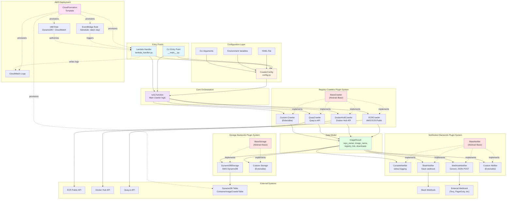
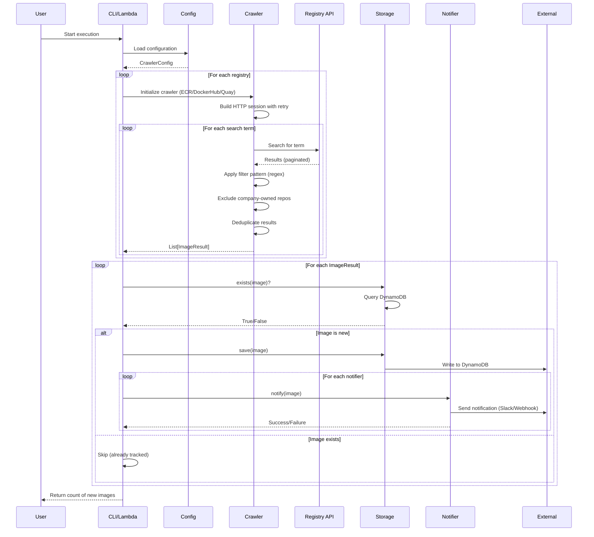

# Container Image Crawler — Architecture

## System Overview

```mermaid
graph TB
    subgraph "Entry Points"
        CLI["CLI Entry Point<br/>__main__.py"]
        Lambda["Lambda Handler<br/>lambda_handler.py"]
    end

    subgraph "Configuration Layer"
        Config["CrawlerConfig<br/>config.py"]
        YAML["YAML File"]
        ENV["Environment Variables"]
        CLIARGS["CLI Arguments"]
    end

    subgraph "Core Orchestration"
        Run["run() function<br/>Main crawler logic"]
    end

    subgraph "Registry Crawlers Plugin System"
        BaseCrawler["BaseCrawler<br/>(Abstract Base)"]
        ECR["ECRCrawler<br/>AWS ECR Public"]
        Docker["DockerHubCrawler<br/>Docker Hub API"]
        Quay["QuayCrawler<br/>Quay.io API"]
        CustomCrawler["Custom Crawler<br/>(Extensible)"]

        BaseCrawler -.implements.-> ECR
        BaseCrawler -.implements.-> Docker
        BaseCrawler -.implements.-> Quay
        BaseCrawler -.implements.-> CustomCrawler
    end

    subgraph "Storage Backends Plugin System"
        BaseStorage["BaseStorage<br/>(Abstract Base)"]
        DynamoDB["DynamoDBStorage<br/>AWS DynamoDB"]
        CustomStorage["Custom Storage<br/>(Extensible)"]

        BaseStorage -.implements.-> DynamoDB
        BaseStorage -.implements.-> CustomStorage
    end

    subgraph "Notification Backends Plugin System"
        BaseNotifier["BaseNotifier<br/>(Abstract Base)"]
        Console["ConsoleNotifier<br/>stdout logging"]
        Slack["SlackNotifier<br/>Slack webhook"]
        Webhook["WebhookNotifier<br/>Generic JSON POST"]
        CustomNotifier["Custom Notifier<br/>(Extensible)"]

        BaseNotifier -.implements.-> Console
        BaseNotifier -.implements.-> Slack
        BaseNotifier -.implements.-> Webhook
        BaseNotifier -.implements.-> CustomNotifier
    end

    subgraph "Data Model"
        ImageResult["ImageResult<br/>repo_owner, image_name,<br/>registry, link, downloads"]
    end

    subgraph "External Systems"
        ECRAPI["ECR Public API"]
        DockerAPI["Docker Hub API"]
        QuayAPI["Quay.io API"]
        DynamoTable["DynamoDB Table<br/>ContainerImageCrawlerTable"]
        SlackAPI["Slack Webhook"]
        WebhookAPI["External Webhook<br/>(Torq, PagerDuty, etc)"]
    end

    subgraph "AWS Deployment"
        CloudFormation["CloudFormation<br/>Template"]
        EventBridge["EventBridge Rule<br/>Schedule: rate(1 day)"]
        IAM["IAM Role<br/>DynamoDB + CloudWatch"]
        Logs["CloudWatch Logs"]
    end

    CLI --> Config
    Lambda --> Config
    YAML --> Config
    ENV --> Config
    CLIARGS --> Config

    Config --> Run
    CLI --> Run
    Lambda --> Run

    Run --> ECR
    Run --> Docker
    Run --> Quay
    Run --> CustomCrawler

    ECR --> ImageResult
    Docker --> ImageResult
    Quay --> ImageResult
    CustomCrawler --> ImageResult

    ImageResult --> DynamoDB
    ImageResult --> CustomStorage

    ImageResult --> Console
    ImageResult --> Slack
    ImageResult --> Webhook
    ImageResult --> CustomNotifier

    ECR --> ECRAPI
    Docker --> DockerAPI
    Quay --> QuayAPI

    DynamoDB --> DynamoTable
    Slack --> SlackAPI
    Webhook --> WebhookAPI

    CloudFormation -.provisions.-> Lambda
    CloudFormation -.provisions.-> DynamoTable
    CloudFormation -.provisions.-> EventBridge
    CloudFormation -.provisions.-> IAM
    CloudFormation -.provisions.-> Logs

    EventBridge -.triggers.-> Lambda
    IAM -.authorizes.-> Lambda
    Lambda -.writes logs.-> Logs

    style CLI fill:#e1f5ff
    style Lambda fill:#e1f5ff
    style Config fill:#fff4e1
    style Run fill:#f0e1ff
    style ImageResult fill:#e1ffe1
    style BaseCrawler fill:#ffe1e1
    style BaseStorage fill:#ffe1e1
    style BaseNotifier fill:#ffe1e1
    style CloudFormation fill:#ffe1f5
```

## Execution Flow

```mermaid
sequenceDiagram
    participant User
    participant CLI/Lambda
    participant Config
    participant Crawler
    participant Registry API
    participant Storage
    participant Notifier
    participant External

    User->>CLI/Lambda: Start execution
    CLI/Lambda->>Config: Load configuration
    Config-->>CLI/Lambda: CrawlerConfig

    loop For each registry
        CLI/Lambda->>Crawler: Initialize crawler (ECR/DockerHub/Quay)
        Crawler->>Crawler: Build HTTP session with retry

        loop For each search term
            Crawler->>Registry API: Search for term
            Registry API-->>Crawler: Results (paginated)
            Crawler->>Crawler: Apply filter pattern (regex)
            Crawler->>Crawler: Exclude company-owned repos
            Crawler->>Crawler: Deduplicate results
            Crawler-->>CLI/Lambda: List[ImageResult]
        end
    end

    loop For each ImageResult
        CLI/Lambda->>Storage: exists(image)?
        Storage->>Storage: Query DynamoDB
        Storage-->>CLI/Lambda: True/False

        alt Image is new
            CLI/Lambda->>Storage: save(image)
            Storage->>External: Write to DynamoDB

            loop For each notifier
                CLI/Lambda->>Notifier: notify(image)
                Notifier->>External: Send notification (Slack/Webhook)
                Notifier-->>CLI/Lambda: Success/Failure
            end
        else Image exists
            CLI/Lambda->>CLI/Lambda: Skip (already tracked)
        end
    end

    CLI/Lambda-->>User: Return count of new images
```

